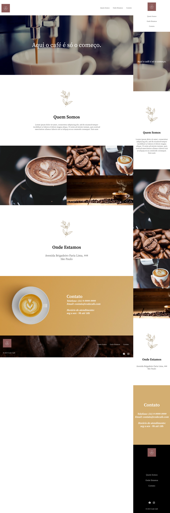

# ☕ Code Café

É um projeto de uma landing page de uma cafeteria fictícia.  

  

## 🔎 Seções do site

- **Quem Somos**: Mostra uma breve explicação sobre a cafeteria.
- **Onde Estamos**: Mostra o endereço da cafeteria.
- **Contato**: Área com telefone e email da cafeteria.
  

## 🚀 Linguagens e Tecnologias utilizadas

- `HTML`: Usado para fazer a estrutura do site.
- `CSS`: Usado para a estilização do site.
- `Figma`: Utilizado para o design do site.
